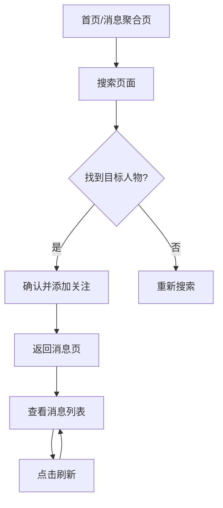

## 1. 产品概述
实时名人消息聚合器是一个Web应用，帮助用户实时追踪关注人物的全网最新动态。用户可搜索并确认目标人物，获取其在48小时内的最新消息，支持多平台信息源聚合。

目标用户：需要实时关注公众人物动态的媒体工作者、投资人、粉丝群体等。产品价值在于节省用户多平台搜索时间，提供一站式消息聚合服务。

## 2. 核心功能

### 2.1 用户角色
| 角色 | 注册方式 | 核心权限 |
|------|----------|----------|
| 普通用户 | 邮箱注册 | 搜索人物、添加关注、查看消息列表 |
| 高级用户 | 付费升级 | 无限制关注人数、消息推送、历史记录 |

### 2.2 功能模块
本产品包含以下核心页面：
1. **搜索页面**：人物搜索、结果确认、添加到关注列表
2. **消息聚合页面**：关注人物消息列表、时间筛选、刷新功能
3. **关注管理页面**：关注列表管理、人物信息展示

### 2.3 页面详情
| 页面名称 | 模块名称 | 功能描述 |
|-----------|-------------|---------------------|
| 搜索页面 | 搜索输入框 | 输入人物姓名，支持中英文搜索 |
| 搜索页面 | 搜索结果 | 展示匹配的人物列表，包含头像、简介、确认按钮 |
| 搜索页面 | 添加关注 | 点击确认后将人物加入关注列表 |
| 消息聚合页 | 消息列表 | 展示所有关注人物48小时内最新消息，按时间倒序排列 |
| 消息聚合页 | 时间筛选 | 可选择24小时、48小时、7天内消息 |
| 消息聚合页 | 刷新按钮 | 手动刷新获取最新数据 |
| 消息聚合页 | 消息卡片 | 显示消息标题、摘要、来源平台、发布时间 |
| 关注管理页 | 关注列表 | 展示已关注人物头像和姓名 |
| 关注管理页 | 取消关注 | 支持移除关注人物 |

## 3. 核心流程
用户操作流程：
1. 用户进入首页，看到默认关注人物消息（特朗普、马斯克、李笑来）
2. 点击搜索框，输入想要关注的人物姓名
3. 系统返回搜索结果，用户确认目标人物
4. 点击"添加关注"，该人物加入关注列表
5. 在消息聚合页查看所有关注人物最新消息
6. 点击刷新按钮获取实时更新

## 4. 用户界面设计

### 4.1 设计风格
- **主色调**：深蓝色 (#1e40af) 作为主色，白色背景，灰色辅助
- **按钮样式**：圆角矩形，hover效果，主要操作为实心按钮
- **字体**：系统默认字体，标题16px，正文14px
- **布局风格**：卡片式布局，顶部导航栏，响应式网格
- **图标风格**：简洁线性图标，使用emoji或SVG图标

### 4.2 页面设计概览
| 页面名称 | 模块名称 | UI元素 |
|-----------|-------------|-------------|
| 消息聚合页 | 顶部导航 | 搜索框居中，左侧logo，右侧用户头像 |
| 消息聚合页 | 消息卡片 | 白色卡片，阴影效果，包含头像、姓名、消息标题、来源图标、时间戳 |
| 搜索页面 | 搜索区域 | 大字体搜索框，搜索按钮，热门推荐 |
| 搜索页面 | 结果列表 | 人物卡片横向排列，包含头像、姓名、简介、关注按钮 |

### 4.3 响应式设计
采用桌面优先设计，适配移动端：
- 桌面端：1200px以上，三栏布局
- 平板端：768-1199px，两栏布局
- 手机端：767px以下，单栏布局，底部导航

### 4.4 平台选择说明
选择Web应用而非浏览器插件的原因：
1. **数据聚合便利**：Web应用更容易集成多个API，避免插件的跨域限制
2. **移动端访问**：用户可在手机浏览器直接使用，无需安装
3. **更新维护**：Web应用更新即时生效，插件需要用户手动更新
4. **功能扩展**：更容易添加用户系统、付费功能等高级特性