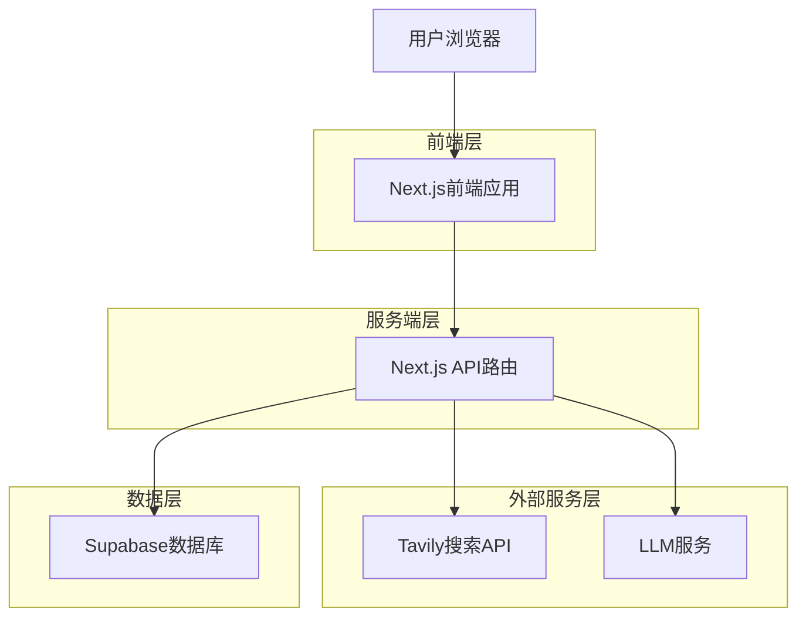
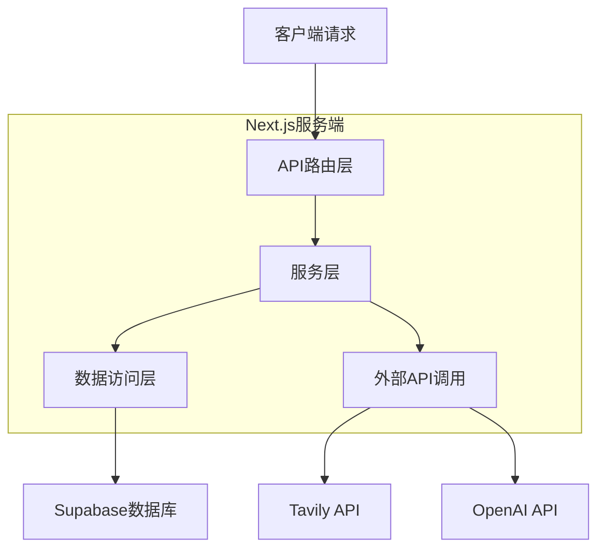
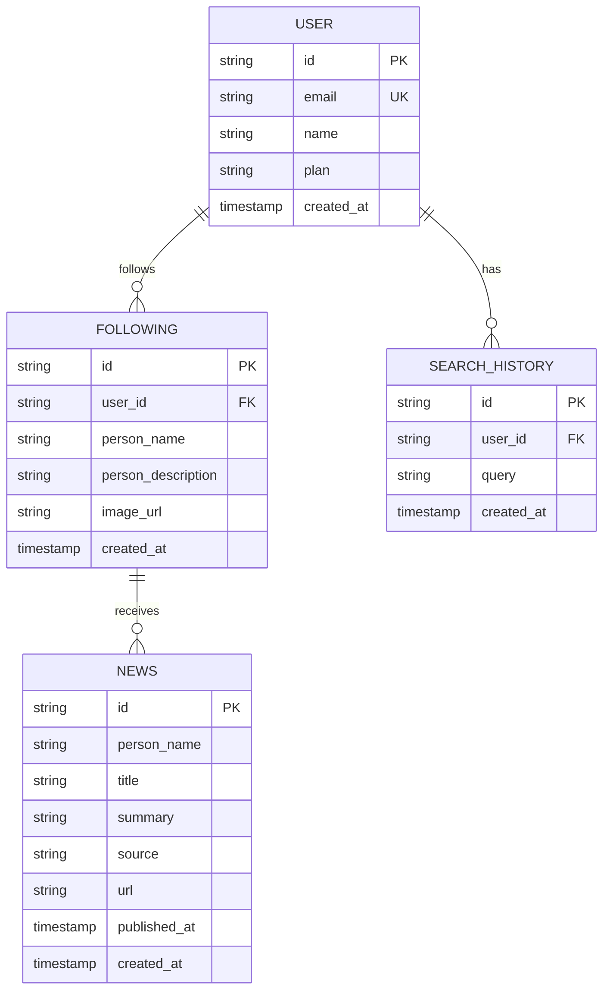

## 1. 架构设计



## 2. 技术描述

- **前端**: Next.js@14 + React@18 + TypeScript + TailwindCSS
- **初始化工具**: create-next-app
- **后端**: Next.js API Routes (服务端渲染)
- **数据库**: Supabase (PostgreSQL)
- **搜索API**: Tavily API / Serper API
- **LLM服务**: OpenAI GPT-4 (用于消息摘要和人物识别)
- **部署**: Vercel (与Next.js原生集成)

## 3. 路由定义

| 路由 | 用途 |
|-------|---------|
| / | 首页，消息聚合展示 |
| /search | 人物搜索页面 |
| /following | 关注管理页面 |
| /api/search | 人物搜索API |
| /api/news | 获取最新消息API |
| /api/following | 关注列表管理API |

## 4. API定义

### 4.1 核心API

人物搜索
```
POST /api/search
```

请求参数:
| 参数名 | 类型 | 必需 | 描述 |
|-----------|-------------|-------------|-------------|
| query | string | true | 搜索关键词 |
| limit | number | false | 返回结果数量，默认5 |

响应:
| 参数名 | 类型 | 描述 |
|-----------|-------------|-------------|
| results | array | 人物列表，包含name, description, image等 |

示例:
```json
{
  "query": "埃隆马斯克",
  "limit": 5
}
```

获取最新消息
```
GET /api/news
```

请求参数:
| 参数名 | 类型 | 必需 | 描述 |
|-----------|-------------|-------------|-------------|
| personId | string | false | 特定人物ID，不传则返回所有关注人物 |
| hours | number | false | 时间范围，默认48小时 |

响应:
| 参数名 | 类型 | 描述 |
|-----------|-------------|-------------|
| news | array | 消息列表，按时间排序 |

## 5. 服务端架构



## 6. 数据模型

### 6.1 数据模型定义



### 6.2 数据定义语言

用户表 (users)
```sql
-- 创建表
CREATE TABLE users (
    id UUID PRIMARY KEY DEFAULT gen_random_uuid(),
    email VARCHAR(255) UNIQUE NOT NULL,
    name VARCHAR(100) NOT NULL,
    plan VARCHAR(20) DEFAULT 'free' CHECK (plan IN ('free', 'premium')),
    created_at TIMESTAMP WITH TIME ZONE DEFAULT NOW(),
    updated_at TIMESTAMP WITH TIME ZONE DEFAULT NOW()
);

-- 创建索引
CREATE INDEX idx_users_email ON users(email);
```

关注人物表 (following)
```sql
-- 创建表
CREATE TABLE following (
    id UUID PRIMARY KEY DEFAULT gen_random_uuid(),
    user_id UUID REFERENCES users(id) ON DELETE CASCADE,
    person_name VARCHAR(255) NOT NULL,
    person_description TEXT,
    image_url VARCHAR(500),
    created_at TIMESTAMP WITH TIME ZONE DEFAULT NOW(),
    UNIQUE(user_id, person_name)
);

-- 创建索引
CREATE INDEX idx_following_user_id ON following(user_id);
```

消息表 (news)
```sql
-- 创建表
CREATE TABLE news (
    id UUID PRIMARY KEY DEFAULT gen_random_uuid(),
    person_name VARCHAR(255) NOT NULL,
    title VARCHAR(500) NOT NULL,
    summary TEXT,
    source VARCHAR(100),
    url VARCHAR(1000),
    published_at TIMESTAMP,
    created_at TIMESTAMP WITH TIME ZONE DEFAULT NOW()
);

-- 创建索引
CREATE INDEX idx_news_person_name ON news(person_name);
CREATE INDEX idx_news_published_at ON news(published_at DESC);
CREATE INDEX idx_news_created_at ON news(created_at DESC);
```

搜索历史表 (search_history)
```sql
-- 创建表
CREATE TABLE search_history (
    id UUID PRIMARY KEY DEFAULT gen_random_uuid(),
    user_id UUID REFERENCES users(id) ON DELETE CASCADE,
    query VARCHAR(255) NOT NULL,
    created_at TIMESTAMP WITH TIME ZONE DEFAULT NOW()
);

-- 创建索引
CREATE INDEX idx_search_history_user_id ON search_history(user_id);
CREATE INDEX idx_search_history_created_at ON search_history(created_at DESC);
```

### 6.3 初始数据
默认关注人物数据：
```sql
-- 需要用户先注册，然后通过API添加默认关注
-- 特朗普、埃隆马斯克、李笑来等人物信息通过搜索API获取
```

## 7. 技术选型理由

1. **Next.js**: 支持服务端渲染，SEO友好，API路由简化开发
2. **Supabase**: 免费额度充足，实时订阅功能，PostgreSQL数据库
3. **Tavily API**: 专为AI应用设计的搜索API，返回结构化数据
4. **OpenAI GPT-4**: 强大的文本理解和摘要能力，提升用户体验
5. **Vercel部署**: 与Next.js完美集成，自动CI/CD，全球CDN